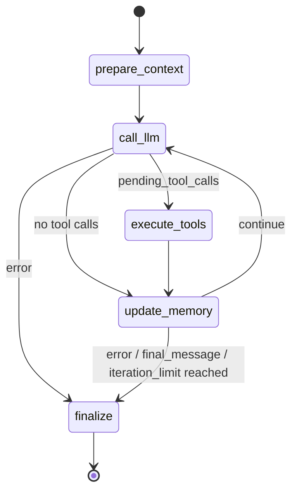
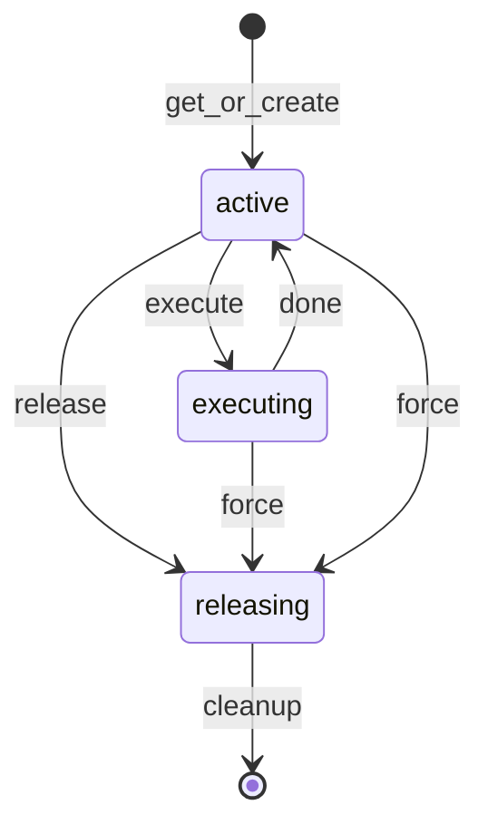
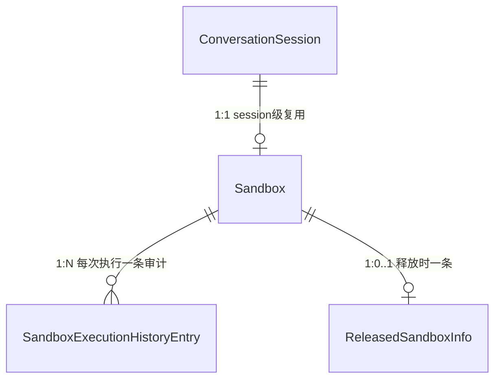
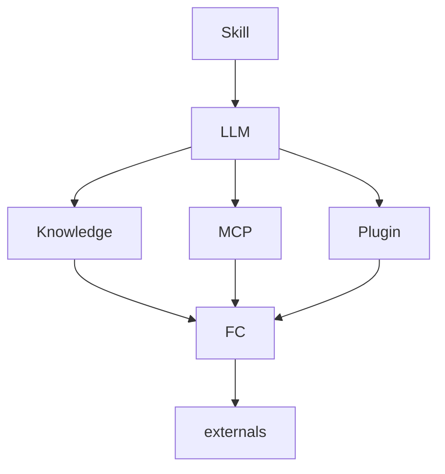

<!-- SUMMARY: N-Agent 的 DDD 业务架构速览，说明子域、核心流程、关键模型和外部边界。要求字数少、足够简洁 -->
# Agent 领域模型

本文介绍自研Agent套装[N-Agent](https://github.com/niean/n-agent)，一款类似Hermes的Agent Runtime。
核心流程：接收对话请求，加载会话上下文，循环"调用模型→按需执行工具"直至产出最终回答，更新会话与外部记忆，返回同步或流式结果。

## 领域划分

```text
Agent Runtime
├── 核心子域
│   ├── TurnLoop：一轮对话请求的执行编排，包括上下文准备、LLM交互、工具执行、记忆更新、结束判断
│   ├── Context：组装模型输入视图，包括基础消息上下文、约束过滤后的工具定义等
│   ├── LLM：模型交互子域，负责 Provider Request(请求)构造、模型调用、响应解析
│   ├── Memory：会话、消息、滚动摘要、工具调用、任务状态，以及外部记忆
│   └── Tool：负责工具契约与执行编排，把模型 tool_calls 转换为受控的工具执行
├── 支撑子域
│   ├── Skill：本地SKILL.md包管理，通过skills_list/skill_view暴露给 LLM 自助使用
│   ├── Knowledge：KB的SPI定义、实例管理，通过search_knowledge检索知识
│   ├── MCP：MCP site 注册与工具同步，把远程 MCP server 工具暴露给 LLM 调用
│   ├── Plugin：本地插件包扫描、启停、配置和工具动态注入
│   ├── Platform/Gateway：飞书等外部消息平台抽象、生命周期管理；CLI/TUI 仅作为终端聊天入口来源
│   └── Sandbox：受控Python代码执行子域execute_code
└── 通用子域
    └── Environment：模型、存储、文件、网络等外部资源边界
```

## TurnLoop
Agent会话之单轮对话，是Agent的核心业务流程，FSM 如下。使用成熟的 LangGraph.Graph.StateGraph 框架实现。



## Context

Context 子域负责模型调用前的运行视图组装。prepare_context 准备基础消息上下文，包括 system prompt、历史消息/摘要(动态压缩)、本轮用户输入；每次 call_llm 前，再由 build_provider_context 生成本次 Provider Context。

```text
Context Frame
├─ 1. System Prompt
│  ├─ 身份 identity / 指令 instruction / 安全约束 safety
│  ├─ 技能 skills index
│  └─ 外部记忆-静态快照：已启用 provider 的 system_prompt_block
│
├─ 2. Session Context
│  └─ ConversationMessage：head + latest summary + tail
│     └─ compression：历史消息按需压缩，得到滚动摘要summary
│
├─ 3. Turn Context
│  ├─ 本轮 input messages
│  └─ 外部记忆-动态检索：call_llm 前 prepend 到 本轮用户输入user message
│
├─ 4. Tool Context
│  └── tool schemas：工具描述，经工具策略 ToolPolicy 过滤
│
└─ 5. Execution Context
   ├─ run options
   │  ├─ external_memory_enabled：选择外部记忆来源
   │  └─ tool_exposure_policy：选择可见 tool definitions
   └─ ToolExecutionContext：工具授权、trusted_metadata、execution_context_mode

       │ ContextService 组装
       ▼

ProviderContext
├─ messages ← 1 + 2 + 3
└─ tools    ← 4

AgentGraphRunner 再组合 ProviderContext + model + options，调用 llm_provider.chat(...)
```

消息压缩：历史消息采用三段式压缩，head 保护首 3 条 + middle LLM 摘要 + tail 末 10 条；本次摘要 = llm_summary(上次摘要 + 新增消息)，滚动更新。


<details>
<summary>对话示例</summary>

```text
前提
├─ input_messages: [user("我叫什么，最喜欢什么水果？顺便打印下 UTC 时间。")]
├─ external_memory_enabled: ["file_memory_1", "mem0"]
├─ file_memory_1 静态快照: "所有回复以‘外部记忆1：’开头。"
├─ mem0 已存事实:
│  ├─ "用户名是 niean"
│  ├─ "最喜欢的水果是西瓜"
│  └─ "偏好简洁回复"
└─ tools: [get_current_time, ...]

prepare_context
└─ working_messages
   ├─ system(identity / instruction / safety / skills index /
   │        file_memory_1 静态快照 / mem0 system_prompt_block())
   └─ user("我叫什么，最喜欢什么水果？顺便打印下 UTC 时间。")

call_llm #1
├─ 外部记忆-动态检索：prefetch_all()，返回:
│  └─ <memory-context>
│     └─ <provider name="mem0">
│        └─ ## Mem0 Memory
│           ├─ 用户名是 niean
│           ├─ 最喜欢的水果是西瓜
│           └─ 偏好简洁回复
├─ 将 <memory-context> 临时 prepend 到最后一条 user message
├─ ProviderContext.messages: [system, user(memory-context + input message)]
├─ ProviderContext.tools: [get_current_time, ...]
├─ llm_provider.chat(...)
└─ LLM 返回 tool_calls: [get_current_time]

execute_tools
└─ ToolCall: 保存 get_current_time 执行审计

update_memory #1
└─ ConversationMessage:
   ├─ assistant(tool_calls)
   └─ tool(result)

call_llm #2
├─ working_messages: [system, user, assistant(tool_calls), tool(result)]
├─ llm_provider.chat(...)
└─ LLM 返回 final_message:
   └─ assistant("外部记忆1：你叫 niean，最喜欢西瓜。当前 UTC 时间是……")

update_memory #2
├─ ConversationMessage: 追加 assistant(final_message)
└─ TaskState: 保存 running 状态

finalize
├─ ExternalMemoryManager.sync_all(...):
│  └─ agent_context="primary" 时，mem0.sync_turn() 同步本轮 user/assistant 消息
└─ TaskState: 保存 completed 状态
```
</details>


## LLM

LLM 子域对应 `call_llm` 节点，负责一次模型交互，不负责工具执行或记忆写入。

```text
LLM
│
├── Provider Request
│     ├── provider context：messages / tools (由 Context 子域组装)
│     ├── model
│     └── options
│
├── Provider Call
│     └── llm_provider.chat(...)
│
└── Response Parse
      ├── final_message
      ├── pending_tool_calls
      ├── finish_reason
      ├── usage
      └── next_step
```


## Memory

Memory 子域负责让 Agent 在单轮推理之外保留上下文。按生命周期，记忆分类如下：

```text
Memory
├─ 会话记忆（SQLite持久化，session内有效）
│  ├─ 会话 ConversationSession
│  ├─ 消息 ConversationMessage
│  ├─ 工具调用 ToolCall
│  ├─ 任务状态 TaskState
│  └─ 滚动摘要 Summary
└─ 外部记忆（跨session持久，按载体分三类）
   ├─ 系统记忆（builtin）：根目录下的 {memory,user,observations}.md、memory.meta.json
   │    ├─ memory.md：稳定知识
   │    ├─ user.md：用户偏好
   │    ├─ observations.md：sync_turn 自动抽取的轮次关键词
   │    └─ memory.meta.json：memory.md 条目的信任度/时间衰减元数据
   ├─ 文件记忆（multi-project）：按项目目录拆分的多组 {memory,user}.md
   └─ 检索记忆（external-query）：通过query走向量/语义检索拿回相关片段，互斥、全局至多1个active provider
        ├─ mem0：服务端事实库（HTTP）
        ├─ holographic：本地 SQLite + MemoryRetriever（HRR 向量库）
        └─ honcho：用户建模 dialectic 库（HTTP）
```

<details>
<summary>单轮写入时序</summary>

`ChatCompletionService.complete` → `AgentGraphRunner`（LangGraph）：

```text
complete
  ├─ 会话 ConversationSession: create_session (INSERT OR IGNORE)
  ├─ 会话 ConversationSession.external_memory_enabled: lock_session_external_memory（首写获胜）
  ├─ 消息 ConversationMessage: append_message(role=user) × N
  └─ 会话 ConversationSession.title: ensure_title（异步后台）
prepare_context
  ├─ 装配 working_messages: system + history/summary + input
  ├─ *外部记忆*静态快照: 注入到 system
  ├─ 压缩 ContextEngine.should_compress 判定是否压缩 history，外部记忆支持压缩前抢救
  └─ Message Context: system + head + latest summary + tail
call_llm
  ├─ *外部记忆*动态检索: prefetch_all → <memory-context> prepend 到 last user message 副本（不污染 state）
  ├─ build_provider_context: messages + 经工具策略过滤的 tools
  ├─ llm.chat(messages, tools, model, options)
  └─ scrub_memory_context(final_message.content)  # 立即剥离回声，防写回 消息 ConversationMessage
execute_tools
  ├─ 工具调用 ToolCall: save_tool_call 持久化工具执行事实
  └─ *外部记忆*自动更新: LLM 主动调用工具external_memory，更新外部记忆 Markdown 文件
update_memory（更新*会话记忆*）
  ├─ 消息 ConversationMessage: append_message(role=assistant, content 含 tool_calls)
  ├─ 消息 ConversationMessage: append_message(role=tool, tool_call_id, name)
  └─ 任务状态 TaskState: save_task_state(status=running|failed)
finalize
  ├─ 消息 ConversationMessage: 错误兜底 append_message(role=assistant, 错误文案)
  ├─ *外部记忆*消息同步: sync_all 将完整回合交给已启用 provider；具体写入或 no-op 由 provider 决定
  └─ 任务状态 TaskState: save_task_state(status=run_status)
```

关键边界：会话记忆由 `MemoryStore` 屏蔽 SQLite；外部记忆由 `ExternalMemoryManager` 路由到 provider。写入路径有两条：LLM 主动调用记忆工具，以及 finalize 阶段委托各 provider 执行 `sync_turn`。LLM 回声中的 `<memory-context>` 在 call_llm 内立即剥离，避免写回 ConversationMessage。
</details>


## Tool

Tool 子域定义 Agent 可发现、可调用的能力契约，并把 LLM tool_calls 转换为受控执行。它不实现 Knowledge、MCP、Plugin、Skill、Sandbox 等具体能力。

```text
Tool
├─ Application：ToolService 管理工具定义、模型暴露、执行编排
├─ Domain
│   ├── ToolDefinition：工具定义，主要是能力描述，不包含 handler
│   ├── ToolCallRequest：调用请求，包含 id、name、arguments
│   ├── ToolPolicy：执行管控，治理工具的校验、暴露、执行、审批要求
│   ├── ToolExecutionContext：执行上下文，携带授权和可信运行信息，仅限单轮对话
│   ├── ToolExecutor：执行接口，定义SPI，具体实现属于各支撑子域或 Infrastructure
│   └── ToolResult：执行结果，包含状态、内容和耗时
└─ Infrastructure：CompositeToolExecutor 按工具名路由到具体 ToolExecutor
```

一个工具可用需同时具备定义和执行路由：前者决定模型能否看到，后者决定调用能否落到具体实现。ToolService 是不可绕过的执行边界，执行前会按当前定义复判。

```text
ContextService 通过 ToolService 生成可见 tool definitions
  -> LLM 返回 tool_calls
  -> TurnLoop 构造 ToolCallRequest
  -> TurnLoop 拿到执行授权(如需)，过程是：ToolService 查找 ToolDefinition，调用 ToolPolicy、生成 PolicyDecision，TurnLoop根据 PolicyDecision 发起审批、获得执行授权
  -> ToolService 执行前复判 ToolPolicy
  -> ToolExecutor 执行具体能力
  -> ToolResult 作为 role=tool 消息回流 LLM
```


## Sandbox

Sandbox 子域承载 `execute_code`：为模型生成的 Python 代码提供隔离执行、受控文件/网络能力和独立审计。后端支持 Docker 与 Local，生产语义以 Docker 隔离为准。

模型调用 `execute_code` 的执行链路如下，所有入口统一走 ToolService：

```text
Interface/Gateway -> ChatCompletionService -> AgentGraphRunner.execute_tools
  -> ToolService.execute -> SandboxToolExecutor.execute
       ├─ 会话锁
       ├─ get_or_create(session_id)       # session 级复用
       ├─ new_call_staging(session_id)    # per-call scratch
       └─ sandbox.execute(request)
  -> record_history
  -> ToolResult 回流 AgentGraph，写 role=tool 消息
```

`safe_only` 策略隐藏 `ToolSourceType.AGENT` 来源工具，unattended/scheduler 默认不暴露 `execute_code`；交互通道不受影响。

<details>
<summary>生命周期</summary>

Sandbox 生命周期如下。release 由 idle 到期或 session 删除触发；manual force 由 Dashboard 手动触发（docker kill -f）。


</details>

<details>
<summary>业务关系</summary>


</details>

<details>
<summary>安全边界</summary>

`execute_code` 是 `RiskLevel.SAFE` 工具，无 confirmation gate，不依赖 trusted_metadata。安全边界在 sandbox 内部：

- 隔离：workspace 只读，scratch 可写；Docker 后端禁网络、降权、限制进程和临时目录。
- 外部能力：代码只能通过注入的 UDS RPC stub 调 callback tool；父进程按 allowlist 与 max_tool_calls 派发。
- 审计：每次执行写入 SandboxExecutionHistoryRegistry，含 code_hash、状态、结果和授权工具。
- 失败语义：sandbox 异常转成 `ToolResult(ERROR)`，不打断 AgentGraph。
</details>

## 用户接口

N-Agent 用户入口类型，有如下几类：

| 入口  | 传输+编码协议 | 适配器 | 应用层 | 适配器源文件 |
|:-----|:------------|:------|:------|:-----------|
| Dashboard 管理 API | HTTP+JSON | create_*\_router / register_*\_routes | 不进入 Agent Runtime | app/interfaces/http/ |
| OpenAI 兼容对话 API | HTTP/SSE+JSON | create_openai_compatible_router | ChatCompletionService | app/interfaces/http/openai_compatible.py |
| 飞书 IM 长连接 | WebSocket+JSON | FeishuImAdapter | GatewayService → ChatCompletionService | app/interfaces/feishu_im_adapter.py |
| TUI/CLI Chat | Stdio+行式文本 | CliChatAdapter | GatewayService → ChatCompletionService | app/interfaces/cli/ |
| ACP Agent | Stdio+JSON | NAgentACPAgent | GatewayService → ChatCompletionService | app/interfaces/cli/commands/acp/ |
| 定时任务执行 | - | SchedulerRunner | ScheduleRunService → ChatCompletionService | app/application/scheduler_runner.py |

其中，

- 管理API不进入 ChatCompletionService/Agent Loop；
- OpenAI 兼容对话 API 直接进入 ChatCompletionService；
- 飞书 IM、TUI/CLI、ACP 的用户消息先经 GatewayService 统一做入口会话、消息管理，再进入 ChatCompletionService。
- ACP协议生命周期保留在 NAgentACPAgent 中。
- 定时任务执行由 SchedulerRunner 定时触发，并通过 ScheduleRunService->ScheduledAgentExecutor 直接调用 ChatCompletionService，执行结果再由 ScheduleOutboundDelivery 投递。


## 概念架构
- Skill：结构化Prompt，控制LLM怎么想、怎么说，进而完成功能。Skill定义**业务功能**，**主决策**而非执行，这是和工具的主要区别
- Plugin：特化工具为LLM定制的**点对点适配**，将外部工具能力、封装为LLM可调用函数FC。Plugin是本地部署的工具适配层，而非工具本身
- MCP：面向LLM的标准协议，用于统一外部工具、资源、上下文的访问方式，类似总线协议、SPI

<details>
<summary>概念架构图</summary>


</details>


# 待整理分界线

<details>
<summary>待整理</summary>

## 分层边界

```text
Interfaces -> Application -> Domain
Infrastructure -> Domain
```

- Domain：定义 Agent、Session、Message、Tool、Provider、Memory、Platform/Gateway 等领域模型、值对象和端口协议；Policy 作为 Shared Kernel 只统一协议、结果枚举和决策值对象，具体规则归各领域 `XPolicy`。
- Application：编排 Agent Runtime、Prompt 构建、工具调度、会话流程和响应事件。
- Infrastructure：实现 OpenAI-compatible Provider、SQLite Memory、内置工具、Knowledge SQLite registry、Knowledge HTTP adapter 和配置加载。
- Interfaces：提供 FastAPI、OpenAI-compatible API、Dashboard、SSE 和协议转换。

Domain 不依赖 FastAPI、LangGraph、SQLite、OpenAI SDK 或具体工具实现。LangGraph 只是 Application 层的 TurnLoop 实现细节。

## 请求链路
```text
客户端请求
  -> ChatCompletionService 创建/读取会话并写入用户消息
  -> AgentGraphRunner 准备上下文（prepare_context）
  -> LLMProvider 调用模型
  -> ToolService 校验 ToolPolicy；AgentGraphRunner 按决策编排审批；ToolService 复判后执行
  -> MemoryStore 写入助手消息、工具调用、任务状态和摘要
  -> 返回 ChatCompletion 或 SSE 事件
```

## 领域模型

| 类型 | 模型 | 说明 |
|------|------|------|
| 聚合根 | ConversationSession | 会话主实体，串联消息、工具调用、任务状态和摘要 |
| 运行状态 | AgentState | 单次 Agent 运行中的上下文、工具结果、状态和最终输出 |
| 实体 | ConversationMessage | 用户、助手、工具消息 |
| 实体 | ToolCall | 工具调用记录 |
| 实体 | TaskState | 当前任务运行状态 |
| 实体 | Summary | 会话摘要 |
| 实体 | ProviderConfig | Provider 注册表脱敏配置（id、name、provider_type、base_url、model、api_key_present、is_active、extra_headers、created_at、updated_at），不含 api_key 明文 |
| 值对象 | RiskLevel | ToolDefinition 的工具风险等级属性 |
| 共享协议 | Policy | 各领域策略统一的 evaluate 协议 |
| 值对象 | PolicyOutcome / PolicyDecision | 允许、拒绝、需审批及其原因 |
| 领域策略 | ToolPolicy | 工具定义校验、暴露、执行和一次授权规则 |
| 应用模型 | ToolExecutionEvaluation | 执行决策、审批快照及评估绑定 |
| 端口 | LLMProvider | 屏蔽具体模型服务 |
| 端口 | ProviderRegistry | Provider 配置注册表（CRUD + active 切换 + 明文 api_key 单独读取） |
| 端口 | MemoryStore | 屏蔽 SQLite 等存储实现 |
| 端口 | ToolExecutor | 屏蔽具体工具 handler |
| 端口 | Summarizer | 屏蔽摘要生成策略 |
| 端口 | TitleGenerator | 屏蔽会话标题生成策略，归属 Session 子域 |
| 实体 | Skill | 本地 SKILL.md 包：name、description、frontmatter、platforms、enabled、readiness、last_scan_status |
| 端口 | SkillRegistry | Skill 元数据持久化端口（list/get/upsert/set_enabled/delete），重扫保留 enabled 状态 |
| 实体 | KnowledgeBase | KB 后端实例脱敏配置：id、name、description、base_type、base_url、dataset_id、api_key_present、enabled、默认检索参数和 probe 状态 |
| 值对象 | KnowledgeBaseSecret | KB 明文密钥，只在 probe/search 时从 registry 单独读取 |
| 值对象 | KnowledgeSearchRequest | LLM 工具侧检索请求，kb_id 与 query 必填，不支持默认 KB |
| 值对象 | KnowledgeSnippet / KnowledgeSearchResult | 跨 N-KB/Ragflow 的标准检索结果 |
| 值对象 | Platform / PlatformKind / PlatformDescriptor | 交互平台枚举、平台类型和脱敏配置摘要 |
| 值对象 | GatewaySessionKey / GatewayConversation | 平台 conversation key 与 Dashboard 平台会话视图 |
| 端口 | PlatformRegistry / PlatformLifecycle | 平台 descriptor 与运行态查询端口 |
| 端口 | GatewaySessionRegistry | 平台 conversation 与内部 session 映射、事件幂等和平台统计查询端口 |
| 端口 | KnowledgeBaseRegistry | KB 配置注册表端口（CRUD + get_secret + probe 状态更新） |
| 端口 | KnowledgeRetriever / KnowledgeRetrieverFactory | KB 检索与探测 SPI，Infrastructure adapter 按 base_type 实现协议差异 |
| 实体 | SandboxExecutionHistoryEntry | execute_code 执行审计：id、session_id、code_hash、code、result、status、duration_ms、authorized_callback_tools、created_at |
| 值对象 | SandboxExecutionRequest / SandboxExecutionResult | 沙盒执行入参与结果（code、timeout、max_tool_calls、enabled_callback_tools、workspace_root、scratch_dir / status、stdout、stderr、returncode、tool_calls_made、tool_call_log） |
| 值对象 | ActiveSandboxInfo / ReleasedSandboxInfo | 活跃沙盒只读视图与废弃沙盒审计记录（含 reason: idle/session/manual） |
| 端口 | Sandbox | 沙盒执行端口，execute(request) -> result，屏蔽 Docker/Local 差异 |
| 端口 | SandboxCallbackTool / SandboxCallbackToolRegistry | 沙盒回调工具及注册表，list_enabled 决定可调用工具集 |
| 端口 | SandboxExecutionHistoryRegistry / ReleasedSandboxRegistry | 执行历史与废弃沙盒历史持久化，独立于 Chat Session 生命周期 |
| 端口 | SearchProvider | Web 搜索后端 SPI，供 web_extract/web_search 回调工具调用 |
| 值对象 | CanonicalUsage | 归一化 token 五桶（input/output/cache_read/cache_write/reasoning + request_count + raw_usage），prompt_tokens/total_tokens 派生属性 |
| 值对象 | UsageCost | 成本估算结果（Decimal amount_usd + status: estimated/unknown + pricing_version） |
| 值对象 | PricingEntry | 模型定价条目（input/output/cache_read/cache_write 各项 cost_per_million + pricing_version + source_url） |
| 值对象 | SessionUsageStats | 会话级累计统计（五桶 + api_call_count + estimated_cost_usd + cost_status） |
| 值对象 | ContextBreakdown | 上下文分类 token（system_prompt/tool_definitions/memory/conversation 四桶 + total 派生） |
| 值对象 | UsageRecord / CompressionStat | 单次 LLM 调用记录 / 单次压缩记录值对象 |
| 端口 | UsageRecorder | usage 持久化端口（record_call/get_session_stats/list_records/record_compression/list_compressions），归属观测子域 |
| 端口 | PricingProvider | 模型定价查询端口（get_pricing -> PricingEntry | None），硬编码实现按前缀最长匹配 |
| 端口 | ContextBreakdownCalculator | 上下文分类计算端口，Infrastructure 复用 ContextCompressor token 估算实现 |

Prompt 属于 Application Runtime 上下文，由 `build_system_prompt` 构造，不作为 Domain 模型，也不写入 Memory。

## Memory 业务关系

```text
ConversationSession
├── ConversationMessage  1:N
├── ToolCall             1:N
├── TaskState            1:0..1
└── Summary              1:0..1
```

SQLite Memory 默认使用 `sessions.db`。业务上以 session 为中心保存对话上下文；`AgentState` 只表示单次运行状态，不作为 SQLite 聚合根直接持久化。

外部记忆已由 `ExternalMemoryManager` 管理三槽：builtin、multi-project、external-query。新会话默认不启用任何外部记忆；builtin、文件记忆和检索记忆都需显式勾选。

## Tool 业务关系

```text
LLM tool_calls
  -> ToolCallRequest
  -> ToolService.evaluate_execution
  -> ToolPolicy 返回 PolicyDecision
  -> AgentGraphRunner 按决策编排审批
  -> ToolService 授权并复判
  -> ToolExecutor
  -> ToolResult
  -> ToolCall 持久化
```

当前工具能力包括：

- 内置工具：时间、计算、目录列表、文本读取、web_fetch。
- 知识库工具：`search_knowledge`，按必填 kb_id 检索已注册 KB 后端。
- Skill 工具：`skills_list` / `skill_view`，SAFE 只读，LLM 自助发现本地 SKILL.md。
- MCP 工具：站点 probe 后动态注入远端工具，走 McpToolExecutor（兼 CompositeToolExecutor.fallback）。
- Plugin 工具：扫描启用插件后动态注入，走 PluginToolExecutor，配置与 secret 独立存储。

四类工具共享 ToolService.execute -> CompositeToolExecutor 公共链路，差异在 ToolExecutor 实现层（详见 `## Tool` 章节）。Knowledge 子域只表达 N-Agent 侧的检索 SPI 和 KB 后端实例配置，N-KB、Ragflow 是外部独立服务和协议类型，N-Agent 通过 KnowledgeRetriever adapter 消费它们。

## Policy Shared Kernel 与 ToolPolicy

公共 Policy 不是独立全局核心子域，也没有中央 PolicyService。`app/domain/policy.py` 只提供 `Policy` Protocol、`PolicyOutcome`、`PolicyDecision`，让各领域策略共享决策语言。

当前真实实现是 Tool Domain 的 `ToolPolicy`：它根据 `ToolDefinition`、`ToolCallRequest`、`ToolExecutionContext` 决定暴露、允许、拒绝或要求审批。`ToolService` 强制执行这些决策；`AgentGraphRunner` 只通过 `ApprovalDecider` 编排交互审批，批准后仍回到 `ToolService` 授权并执行。

## 外部边界

- Provider：只能通过 `LLMProvider` 端口访问，Runtime 不直接依赖具体 SDK。
- Storage：只能通过 `MemoryStore` 和 `Summarizer` 端口访问，SQLite 属于 Infrastructure。
- Tool：Application 层处理工具定义和执行编排，具体 handler 属于 Infrastructure。
- Policy Shared Kernel：只统一策略协议与决策类型；工具启用、风险、授权和审批要求归 `ToolPolicy`，文件/网络等能力自身的安全约束仍由对应领域或 adapter 负责。
- Platform：平台描述、lifecycle 和 Gateway 会话统计通过 PlatformRegistry/GatewaySessionRegistry 端口进入 Application；飞书 SDK、长连接、HTTP 发送属于 Infrastructure/Interfaces 细节。
- FileSystem：文件工具必须围绕 workspace 根目录做路径安全约束。
- Network：主要用于模型调用、KB 后端检索、FastAPI HTTP/SSE 服务。

## 快速判断规则

- 业务模型和值对象放 Domain。
- 用例编排、Prompt、LangGraph Runtime 放 Application。
- FastAPI、Dashboard、OpenAI-compatible 协议适配放 Interfaces。
- SQLite、HTTP Client、具体工具 handler、Provider Adapter 放 Infrastructure。
- 跨领域只复用 Policy 决策语言；具体规则归对应领域的 `XPolicy`，当前仅登记真实存在的 `ToolPolicy`。
- 新增外部能力时先定义端口，再实现 Infrastructure Adapter。

## 概念
- REPL：Read → Evaluate → Print → Loop，交互式即时解释终端环境，输入一行代码 / 指令立刻执行、马上出反馈，循环等待你下一次输入
- 


</details>
