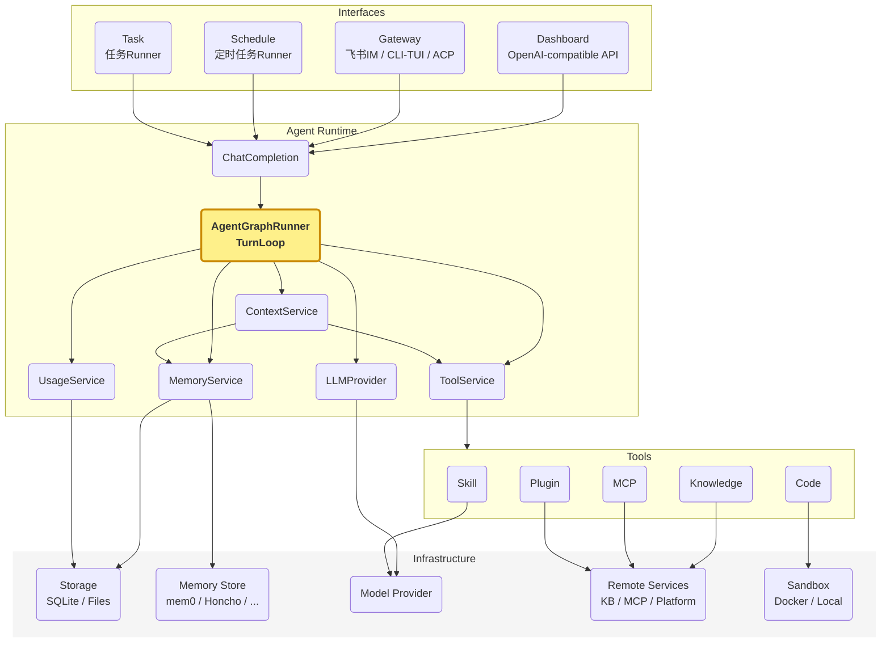
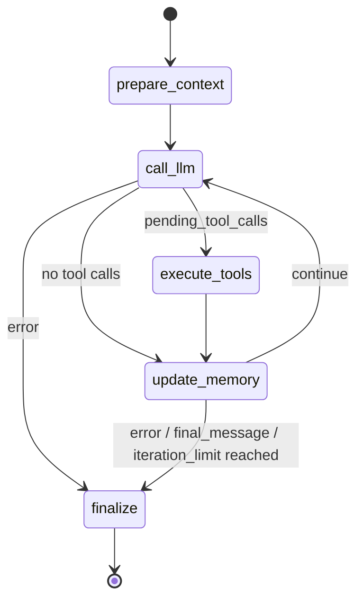
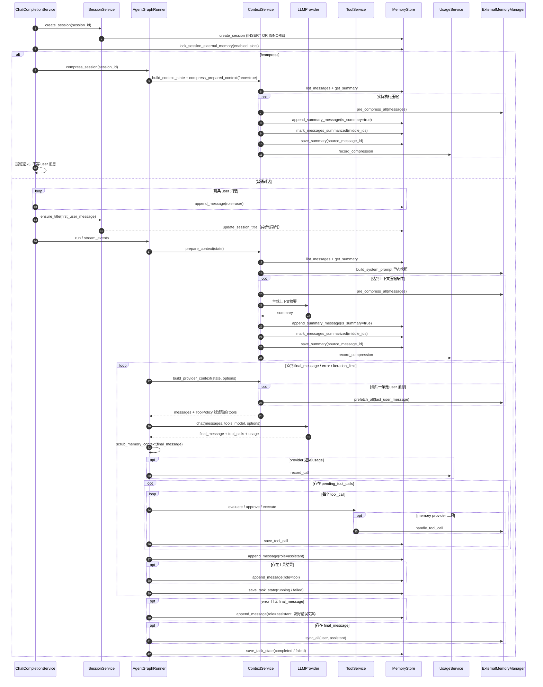
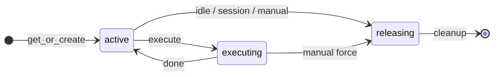
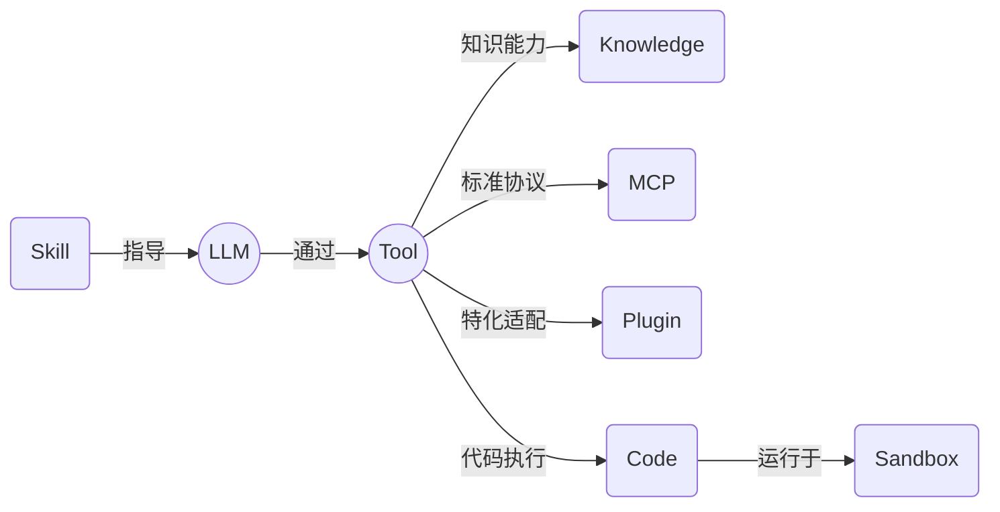
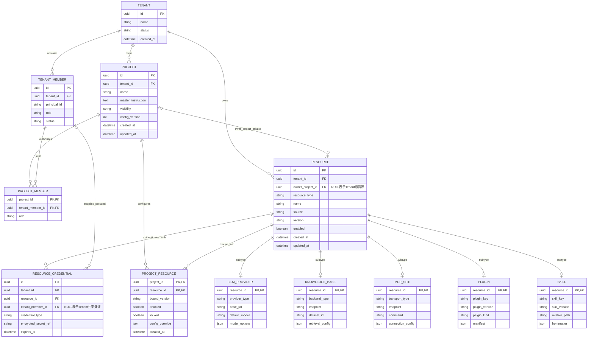

<!-- SUMMARY: N-Agent 的 DDD 业务架构速览，说明子域、核心流程、关键模型和外部边界。要求字数少、足够简洁 -->
# Agent 领域模型

本文介绍自研通用Agent Runtime [N-Agent](https://github.com/niean/n-agent)。N-Agent 以 LangGraph 编排 Agent TurnLoop，用领域驱动设计（DDD）隔离业务核心与外部实现，支撑持续演进。

核心流程：接收对话请求，加载会话上下文，循环"调用模型→按需执行工具"直至产出最终回答，更新会话与外部记忆，返回同步或流式结果。


## 领域划分

```text
Agent Runtime
├── 核心子域
│   ├── TurnLoop：单轮对话执行编排，包括上下文准备、LLM交互、工具执行、记忆更新、结束判断
│   ├── Context：组装模型输入视图，包括基础消息上下文、约束过滤后的工具定义等
│   ├── LLM：模型交互子域，负责Provider Request(请求)构造、模型调用、响应解析
│   ├── Memory：记忆管理，包括会话记忆、跨会话的外部记忆
│   └── Tool：工具契约与执行编排，把模型 tool_calls 转换为受控的工具执行
├── 支撑子域
│   ├── Knowledge：KB的SPI定义、实例管理，通过search_knowledge检索知识
│   ├── MCP：MCP site 注册与工具同步，把远程 MCP server 工具暴露给 LLM 调用
│   ├── Plugin：本地插件包扫描、启停、配置和工具动态注入
│   ├── Skill：本地SKILL.md包管理，通过skills_list/skill_view暴露给 LLM 自助使用
│   ├── Sandbox：受控代码执行子域execute_code(Python)、terminal(Shell)
│   ├── Schedule：定时任务定义、调度、租约执行与结果投递
│   ├── Gateway：统一飞书、CLI/TUI、ACP 的交互消息、入口会话、命令与确认，并路由至ChatCompletionService
│   ├── Platform：飞书等外部消息平台抽象，生命周期管理
│   └── Usage/Observation：模型用量、成本、上下文构成与压缩收益观测
├── Shared Kernel
│   └── Policy：通用决策契约
└── 外部边界
    ├── Storage
    └── Model Provider
```

系统核心模块，如下：




## TurnLoop
Agent会话之单轮对话，是Agent的核心业务流程，FSM状态图如下：



单轮对话 SD时序图如下：`ChatCompletionService.complete` → `AgentGraphRunner`（LangGraph.Graph.StateGraph）




## Context

Context 子域负责模型调用前的运行视图组装。prepare_context 准备基础消息上下文，包括 system prompt、历史消息/摘要(动态压缩)、本轮用户输入；每次 call_llm 前，再由 build_provider_context 生成本次 Provider Context。

```text
Context Frame
├─ 1. System Prompt
│  ├─ 身份 identity / 指令 instruction / 安全约束 safety
│  ├─ 技能 skills index
│  └─ 外部记忆-静态快照：已启用 provider 的 system_prompt_block
│
├─ 2. Session Context
│  └─ ConversationMessage：head + latest summary + tail
│     └─ compression：历史消息滚动压缩，最新摘要latest summary
│
├─ 3. Turn Context
│  ├─ 本轮 input messages
│  └─ 外部记忆-动态检索：call_llm 前 prepend 到 本轮用户输入user message
│
├─ 4. Tool Context
│  └── tool schemas：工具描述，经工具策略 ToolPolicy 过滤
│
└─ 5. Execution Context
   ├─ run options
   │  ├─ external_memory_enabled：选择外部记忆来源
   │  └─ tool_exposure_policy：选择可见 tool definitions
   └─ ToolExecutionContext：工具授权、trusted_metadata、execution_context_mode

       │ ContextService 组装
       ▼

ProviderContext
├─ messages ← 1 + 2 + 3
└─ tools    ← 4

AgentGraphRunner 再组合 ProviderContext + model + options，调用 llm_provider.chat(...)
```


<details markdown="1">
<summary>对话示例</summary>

```text
前提
├─ input_messages: [user("我叫什么，最喜欢什么水果？顺便打印下 UTC 时间。")]
├─ external_memory_enabled: ["file_memory_1", "mem0"]
├─ file_memory_1 静态快照: "所有回复以‘外部记忆1：’开头。"
├─ mem0 已存事实:
│  ├─ "用户名是 niean"
│  ├─ "最喜欢的水果是西瓜"
│  └─ "偏好简洁回复"
└─ tools: [get_current_time, ...]

prepare_context
└─ working_messages
   ├─ system(identity / instruction / safety / skills index /
   │        file_memory_1 静态快照 / mem0 system_prompt_block())
   └─ user("我叫什么，最喜欢什么水果？顺便打印下 UTC 时间。")

call_llm #1
├─ 外部记忆-动态检索：prefetch_all()，返回:
│  └─ <memory-context>
│     └─ <provider name="mem0">
│        └─ ## Mem0 Memory
│           ├─ 用户名是 niean
│           ├─ 最喜欢的水果是西瓜
│           └─ 偏好简洁回复
├─ 将 <memory-context> 临时 prepend 到最后一条 user message
├─ ProviderContext.messages: [system, user(memory-context + input message)]
├─ ProviderContext.tools: [get_current_time, ...]
├─ llm_provider.chat(...)
└─ LLM 返回 tool_calls: [get_current_time]

execute_tools
└─ ToolCall: 保存 get_current_time 执行审计

update_memory #1
└─ ConversationMessage:
   ├─ assistant(tool_calls)
   └─ tool(result)

call_llm #2
├─ working_messages: [system, user, assistant(tool_calls), tool(result)]
├─ llm_provider.chat(...)
└─ LLM 返回 final_message:
   └─ assistant("外部记忆1：你叫 niean，最喜欢西瓜。当前 UTC 时间是……")

update_memory #2
├─ ConversationMessage: 追加 assistant(final_message)
└─ TaskState: 保存 running 状态

finalize
├─ ExternalMemoryManager.sync_all(...):
│  └─ agent_context="primary" 时，mem0.sync_turn() 同步本轮 user/assistant 消息
└─ TaskState: 保存 completed 状态
```
</details>


## LLM

LLM 子域对应 `call_llm` 节点，负责一次模型交互，不负责工具执行或记忆写入。

```text
LLM
│
├── Provider Request
│     ├── provider context：messages / tools (由 Context 子域组装)
│     ├── model
│     └── options
│
├── Provider Call
│     └── llm_provider.chat(...)
│
└── Response Parse
      ├── final_message
      ├── pending_tool_calls
      ├── finish_reason
      ├── usage
      └── next_step
```


## Memory

Memory 有两条持久化边界：会话记忆保存当前 session 的运行事实，外部记忆保存跨 session 知识。

```text
Memory
├─ 会话记忆: MemoryStore → SQLiteMemoryStore
│  ├─ ConversationSession: source / title / external_memory_enabled / slots / ACP metadata
│  ├─ ConversationMessage: user / assistant / tool / is_summary / is_summarized
│  └─ ToolCall / TaskState / Summary
└─ 外部记忆: ExternalMemoryProvider → ExternalMemoryManager → Provider Adapter
   ├─ builtin: Markdown + trust metadata + observations
   ├─ multi-project: 多目录 Markdown
   └─ external-query: mem0 / holographic / honcho，全局至多一个 active
```

| 槽位 | 实现 | 存储与写入 |
|------|------|-----------|
| builtin | `BuiltinProjectMemory` | `{memory,user,observations}.md` + `memory.meta.json`；`sync_turn` 追加观察 |
| multi-project | `MultiProjectMemory` | 每个项目一组 `{memory,user}.md`；`sync_turn` 为 no-op，只由工具写入 |
| external-query | `Mem0Adapter` | HTTP 事实库 |
| external-query | `HolographicAdapter` | 本地 SQLite；`MemoryRetriever` 使用 Jaccard + 词频检索 |
| external-query | `HonchoAdapter` | HTTP workspace / peer / session context |


## Tool

Tool 子域定义 Agent 可发现、可调用的能力契约，并把 LLM tool_calls 转换为受控执行。它不实现 Knowledge、MCP、Plugin、Skill、Sandbox 等具体能力。

```text
Tool
├─ Application：ToolService 管理工具定义、模型暴露、执行编排
├─ Domain
│   ├── ToolDefinition：工具定义，主要是能力描述，不包含 handler
│   ├── ToolCallRequest：调用请求，包含 id、name、arguments
│   ├── ToolPolicy：执行管控，治理工具的校验、暴露、执行、审批要求
│   ├── ToolExecutionContext：执行上下文，携带授权和可信运行信息，仅限单轮对话
│   ├── ToolExecutor：执行接口，定义SPI，具体实现属于各支撑子域或 Infrastructure
│   └── ToolResult：执行结果，包含状态、内容和耗时
└─ Infrastructure：CompositeToolExecutor 按工具名路由到具体 ToolExecutor
```

一个工具可用需同时具备定义和执行路由：前者决定模型能否看到，后者决定调用能否落到具体实现。ToolService 是不可绕过的执行边界，执行前会按当前定义复判。

```text
ContextService 通过 ToolService 生成可见 tool definitions
  -> LLM 返回 tool_calls
  -> TurnLoop 构造 ToolCallRequest
  -> TurnLoop 拿到执行授权(如需)，过程是：ToolService 查找 ToolDefinition，调用 ToolPolicy、生成 PolicyDecision，TurnLoop根据 PolicyDecision 发起审批、获得执行授权
  -> ToolService 执行前复判 ToolPolicy
  -> ToolExecutor 执行具体能力
  -> ToolResult 作为 role=tool 消息回流 LLM
```


## Sandbox

Sandbox 子域为模型提供受控执行环境，承载 `execute_code`（Python）与 `terminal`（Shell）。两者均为 `RiskLevel.SAFE`工具，Docker 是生产安全边界、不走审批。

所有入口统一经过 ToolService，并按工具路由到独立 Executor：

```text
Interface/Gateway -> ChatCompletionService -> AgentGraphRunner.execute_tools
  -> ToolService.execute
       ├─ execute_code -> SandboxToolExecutor
       │    └─ 会话锁 -> get_or_create -> per-call staging -> Sandbox.execute
       └─ terminal -> TerminalToolExecutor
            └─ 会话锁 -> get_or_create -> 校验 workdir -> Sandbox.exec_command
  -> SandboxExecutionHistoryRegistry
  -> ToolResult 回流 AgentGraph，写 role=tool 消息
```

<details markdown="1">
<summary>生命周期</summary>

`SandboxManager` 按 session 懒创建并串行执行。空闲到期或 session 删除时协作释放；Dashboard 可强制释放。Docker 启动时还会清理上次进程遗留的孤儿容器。


</details>


<details markdown="1">
<summary>安全边界</summary>

- Docker：workspace 只读、scratch 可写，默认禁网，并限制 CPU、内存、进程与临时目录。
- `execute_code`：外部能力仅能通过 UDS RPC callback tools 获取，并受 allowlist、调用次数与超时约束。
- `terminal`：不使用 callback tools；workdir 仅允许 scratch/workspace，workspace 仍只读。非零退出码表示命令执行失败，但工具状态仍为 SUCCESS；仅超时或执行异常映射为 TIMEOUT/ERROR。
- 审计：两类执行都持久化 code_hash、状态、结果和 `execution_type`；Sandbox 异常转为 `ToolResult(ERROR)`，不打断 AgentGraph。
</details>


## XUI

N-Agent 用户入口类型，有如下几类：

| 入口  | 传输+编码协议 | 适配器 | 应用层 | 适配器源文件 |
|:-----|:------------|:------|:------|:-----------|
| Dashboard 管理 API | HTTP+JSON | create_*\_router / register_*\_routes | 不进入 Agent Runtime | app/interfaces/http/ |
| OpenAI 兼容对话 API | HTTP/SSE+JSON | create_openai_compatible_router | ChatCompletionService | app/interfaces/http/openai_compatible.py |
| 飞书 IM 长连接 | WebSocket+JSON | FeishuImAdapter | GatewayService → ChatCompletionService | app/interfaces/feishu_im_adapter.py |
| TUI/CLI Chat | Stdio+行式文本 | CliChatAdapter | GatewayService → ChatCompletionService | app/interfaces/cli/ |
| ACP Agent | Stdio+JSON | NAgentACPAgent | GatewayService → ChatCompletionService | app/interfaces/cli/commands/acp/ |
| 定时任务执行 | - | SchedulerRunner | ScheduleRunService → ChatCompletionService | app/application/scheduler_runner.py |
| 任务执行 | - | TaskRunner | TaskRunService → ChatCompletionService | app/application/task_runner.py |

其中，

- 管理API不进入 ChatCompletionService/Agent Loop；
- OpenAI 兼容对话 API 直接进入 ChatCompletionService；
- 飞书 IM、TUI/CLI、ACP 的用户消息先经 GatewayService 统一做入口会话、消息管理，再进入 ChatCompletionService。
- ACP协议生命周期保留在 NAgentACPAgent 中。
- 定时任务执行由 SchedulerRunner 定时触发，并通过 ScheduleRunService->ScheduledAgentExecutor 直接调用 ChatCompletionService，执行结果再由 ScheduleOutboundDelivery 投递。
- 任务执行由 TaskRunner 触发，并通过 TaskRunService->TaskAgentExecutor 直接调用 ChatCompletionService。


---
---
以下是一些概念澄清、技术要点。

## 产品形态

对话=交互问答；定时任务=定时触发投递；任务=目标驱动异步后台执行，任务状态机 + 意图分解 + 多次AgentRun + 汇总 + Artifact。

```text
①对话 ChatCompletion：
用户提问 → AgentRun → 回复消息

②定时任务 Schedule：
定时触发 -> ChatCompletion -> 结果投递

③任务 Task：
用户交代目标 → 意图分解 → 多次 ChatCompletionService → 汇总 + Artifact

```

## 工具概念
- Skill：结构化Prompt，指导LLM怎么想、怎么说，进而完成功能。Skill定义**业务逻辑**，主决策而非执行，这是和其它工具的区别
- Plugin：特化工具为LLM定制的点对点适配，将外部工具能力、封装为LLM可调用函数FC/Tool；Plugin是本地部署的工具适配层，而非工具本身
- MCP：面向LLM的标准协议，用于统一外部工具、资源、上下文的访问方式，类似总线协议。站在LLM领域看，**MCP是SPI、Plugin是Adapter**




## 消息压缩

消息压缩属于 Context 子域，用于在模型上下文过长时保留开头和最近消息，并把中间可压缩消息滚动归并为摘要。默认形态：`head 3 + latest summary + tail 10`，`latest summary = llm_summary(last summary + middle)`。

```text
ConversationMessage + Summary
  -> ContextService.prepare_context 读取会话消息和 latest summary
  -> ContextPolicy 判断是否需要压缩，生成 CompressionPlan(head_n / tail_n / target_ratio)
  -> ExternalMemoryManager.pre_compress_all 抢救待压缩消息中的外部记忆线索
  -> ContextCompressor 按 head + middle + tail 切分；middle 与上次摘要一起生成新 summary
  -> 结果写成 head + latest summary + tail，避免把摘要追加到末尾
  -> MemoryStore 依次 append_summary_message -> mark_messages_summarized -> save_summary
  -> UsageService 记录压缩前后 token 与摘要观测
```


## Skill自进化

Skill 自进化是 Agent Runtime 对会话摘要的后台审查，把可复用、非平凡工作流沉淀为受治理的技能。每隔N轮对话触发1次自进化审查。

```text
会话摘要 digest
  -> SkillEvolutionService 按 nudge_interval 后台触发 maybe_trigger(session_id, turn_count, digest)
  -> 以 SkillWriteOrigin.BACKGROUND_REVIEW fork 审查 Agent，仅暴露 skills_list / skill_view / skill_manage
  -> 审查摘要是否值得持久化；修改已有 Skill 前必须 skill_view 读取目标
  -> SkillService.manage_skill 统一写入口和规范；SkillPolicy 判定 allow / require_approval / deny
  -> 通过 SkillFileLoader 写入 SKILL.md，并由 SkillRegistry / SkillUsageRegistry 记录可见性与使用事实
  -> 下轮 Context 的 System Prompt 注入 skills index；LLM 再通过 skills_list / skill_view 加载具体 Skill
```

## 安全策略

任务子域安全策略与配置按可配置性分三类（权威定义见 .harness/knowledge/03-conventions.md "任务安全策略分类"）：

- A 类 安全不变量（只读，禁止配置）：任务状态机/claim 契约/断路条件逻辑、Worker 安全（工具剥离/Judge 只读/token 不透明/入口来源/执行模式）、审批安全（会话隔离/存在性不泄漏/revise 必填/未知字段拒绝）
- B 类 启动期绑定（env-only，改需重启）：task_enabled、task_dispatch_interval_seconds、task_shutdown_grace_seconds
- C 类 运行时可配（Dashboard 可编辑 + 热重载）：并发/租约/心跳/运行时长/目标轮次/附件限额/失败上限/note 上限，经 TaskConfigProvider 热重载，SQLite task_config 单行逐字段覆盖

本地 Shell：terminal 工具在 Sandbox 子域执行（workspace 只读、scratch 可写、workdir 仅允许 scratch/workspace），详见 ## Sandbox 章节；host_terminal 走宿主子域独立 Policy。

## Browser Use
Container VNC：Chromium → Xvfb → x11vnc → noVNC → websockify → Dashboard。Chromium 运行在 Xvfb 提供的虚拟显示器中，Playwright 通过 CDP `9222` 执行 Agent 自动化动作；x11vnc 将该显示器发布为 VNC，noVNC 作为浏览器端 HTML5 VNC 客户端，websockify 负责把Dashboard浏览器 WebSocket 转换为 VNC TCP 流量。


---
---

# 待整理分界线

<details markdown="1">
<summary>待整理</summary>

## 资源隔离




## 分层边界

```text
Interfaces -> Application -> Domain
Infrastructure -> Domain
```

- Domain：按领域划分定义 TurnLoop、Context、LLM、Memory、Tool 等核心子域，Skill、Knowledge、MCP、Plugin、Platform、Gateway、Schedule、Sandbox、Usage/Observation 等支撑子域的领域模型、值对象和端口协议；Policy 作为 Shared Kernel 只统一协议、结果枚举和决策值对象，具体规则归各领域 `XPolicy`。
- Application：编排 Agent Runtime、Prompt 构建、工具调度、会话流程和响应事件。
- Infrastructure：实现 OpenAI-compatible Provider、SQLite Memory、内置工具、Knowledge SQLite registry、Knowledge HTTP adapter 和配置加载。
- Interfaces：提供 FastAPI、OpenAI-compatible API、Dashboard、SSE 和协议转换。

Domain 不依赖 FastAPI、LangGraph、SQLite、OpenAI SDK 或具体工具实现。LangGraph 只是 Application 层的 TurnLoop 实现细节。

## 请求链路
```text
客户端请求
  -> ChatCompletionService 创建/读取会话并写入用户消息
  -> AgentGraphRunner 准备上下文（prepare_context）
  -> LLMProvider 调用模型
  -> ToolService 校验 ToolPolicy；AgentGraphRunner 按决策编排审批；ToolService 复判后执行
  -> MemoryStore 写入助手消息、工具调用、任务状态和摘要
  -> 返回 ChatCompletion 或 SSE 事件
```

## 领域模型

| 归属 | 类型 | 模型 | 说明 |
|------|------|------|------|
| TurnLoop | 运行模型 | AgentRun / AgentState / RunStatus / EndReason | 单次 Agent 运行、图内状态、运行阶段和结束原因 |
| Context | 值对象 | ProviderContext | 本次模型调用可见的 messages 与 tools |
| Context | 值对象 | ContextCompressionResult | 压缩后的消息、摘要、token 和被摘要消息索引 |
| Context | 端口 | ContextEngine | 判断并执行消息上下文压缩 |
| LLM | 值对象 | ModelInfo / LLMEvent / LLMResult | 模型信息、流式事件和标准调用结果 |
| LLM | 值对象 | ProviderConfig | Provider 脱敏配置，不包含 api_key 明文 |
| LLM | 端口 | LLMProvider / ProviderRegistry | 模型调用与 Provider 配置注册边界 |
| Memory | 聚合根 | ConversationSession | 会话主实体，串联消息、工具调用、任务状态和摘要 |
| Memory | 实体 | ConversationMessage / ToolCall / TaskState / Summary | 会话消息、工具审计、任务状态和滚动摘要 |
| Memory | 端口 | MemoryStore / Summarizer / TitleGenerator | 会话持久化、摘要和标题生成边界 |
| Memory | 值对象 | ExternalMemoryProviderConfig / ExternalMemoryProviderSecret | 检索记忆 Provider 的脱敏配置与独立密钥 |
| Memory | 端口 | ExternalMemoryProvider / ExternalMemoryProviderRegistry | 外部记忆读写与检索记忆 Provider 注册边界 |
| Tool | 值对象 | ToolDefinition / ToolCallRequest / ToolExecutionContext / ToolResult | 工具定义、调用、单轮授权上下文和执行结果 |
| Tool | 值对象 | RiskLevel / ToolExposurePolicy | 工具风险等级与模型暴露范围 |
| Tool | 领域策略 | ToolPolicy | 工具定义校验、暴露、执行决策和一次授权 |
| Tool | 端口 | ToolExecutor | 屏蔽具体工具 handler |
| Tool | 应用模型 | ToolExecutionEvaluation | 执行决策、审批快照及评估绑定 |
| Skill | 实体 | Skill | 本地 SKILL.md 包及启用、就绪和扫描状态 |
| Skill | 值对象 | SkillFrontmatter / SkillReadiness | Skill 元数据和就绪状态 |
| Skill | 端口 | SkillRegistry | Skill 元数据持久化边界 |
| Knowledge | 实体 | KnowledgeBase | KB 后端实例的脱敏配置和探测状态 |
| Knowledge | 值对象 | KnowledgeBaseSecret / KnowledgeSearchRequest / KnowledgeSearchResult | KB 密钥、标准检索请求和结果 |
| Knowledge | 端口 | KnowledgeBaseRegistry / KnowledgeRetriever / KnowledgeRetrieverFactory | KB 注册、检索和 adapter 创建边界 |
| MCP | 实体 | McpSite / McpTool | MCP 站点及本地工具映射 |
| MCP | 值对象 | McpRemoteTool / McpProbeResult | 远端工具描述和站点探测结果 |
| MCP | 端口 | McpSiteRegistry | MCP 站点、工具和探测状态注册边界 |
| Plugin | 聚合根 | Plugin | 本地插件包及公开视图、配置和 secret 引用 |
| Plugin | 值对象 | PluginManifest / PluginKind / PluginSource / PluginScanStatus | 插件清单、类型、来源和扫描状态 |
| Plugin | 端口 | PluginRegistry | 插件元数据、配置和 secret 持久化边界 |
| Platform | 值对象 | Platform / PlatformKind / PlatformDescriptor | 外部消息平台枚举、类型和脱敏描述 |
| Platform | 端口 | PlatformLifecycle / PlatformRegistry | 平台生命周期和注册查询边界 |
| Gateway | 值对象 | GatewaySessionKey / InteractionMessage / GatewayOutboundMessage / InteractionResponse | 入口会话键、统一交互消息和回复 |
| Gateway | 实体 | GatewaySessionLink / GatewayConversation / GatewayHomeTarget | 外部 conversation、内部 session 映射和平台投递目标 |
| Gateway | 值对象 | GatewayConfirmationRequest / GatewayConfirmationAction / GatewayConfirmationChoice | Gateway 命令确认上下文、动作和选择 |
| Gateway | 端口 | GatewaySessionRegistry | 会话映射、事件幂等、home target 和平台统计边界 |
| Schedule | 聚合根 | ScheduledTask | 定时任务定义、状态、执行策略、租约和投递目标 |
| Schedule | 实体 | ScheduledTaskExecution | 单次定时任务执行和投递结果 |
| Schedule | 值对象 | ScheduleExpression / ScheduleTimezone / ScheduledTaskClaim / ScheduledTaskLease | 调度表达式、时区、claim 和租约 |
| Schedule | 值对象 | DeliveryTarget / DeliveryResult / ScheduledExecutionPolicy | 投递目标、结果和无人值守执行策略 |
| Schedule | 端口 | ScheduledTaskRegistry / ScheduleCalculator / PromptSafetyScanner / OutboundDelivery | 任务持久化、调度计算、Prompt 安全和投递边界 |
| Sandbox | 值对象 | SandboxExecutionRequest / SandboxExecutionResult | execute_code 的执行入参与结果 |
| Sandbox | 值对象 | SandboxExecResult | terminal 的 shell 执行结果，非零 returncode 仍可表示 SUCCESS |
| Sandbox | 实体 | SandboxExecutionHistoryEntry | execute_code 与 terminal 共用的执行审计，execution_type 区分类型 |
| Sandbox | 值对象 | ActiveSandboxInfo / ReleasedSandboxInfo | 活跃沙盒视图与释放审计，reason 为 idle/force/session/release |
| Sandbox | 端口 | Sandbox | `execute` 执行 Python，`exec_command` 执行 Shell |
| Sandbox | 端口 | SandboxCallbackTool / SandboxCallbackToolRegistry / SearchProvider | execute_code 回调工具及搜索能力边界 |
| Sandbox | 端口 | SandboxExecutionHistoryRegistry / ReleasedSandboxRegistry | 执行历史与释放历史持久化边界 |
| Usage/Observation | 值对象 | CanonicalUsage / UsageCost / PricingEntry | Token 归一化、成本和模型定价 |
| Usage/Observation | 值对象 | SessionUsageStats / ContextBreakdown / UsageRecord / CompressionStat | 会话累计、上下文构成、调用和压缩记录 |
| Usage/Observation | 端口 | UsageRecorder / PricingProvider / ContextBreakdownCalculator | 用量持久化、定价查询和上下文分类边界 |
| Shared Kernel | 共享协议 | Policy / PolicyOutcome / PolicyDecision / PolicyAuditEvent / PolicyAuditSink / ExecutionMode / PolicyDecisionKind | 各领域策略共用的评估协议、决策语言和审计通道 |
| Policy Mesh | 领域策略 | TurnPolicy / ContextPolicy / LLMPolicy / ToolPolicy / MemoryPolicy / SandboxPolicy / GatewayPolicy / SchedulePolicy / BudgetPolicy / InformationFlowPolicy | 10 个独立领域 Policy，各自治理一个维度，不跨域导入 |
| Policy Mesh | 值对象 | BudgetReservationDecision / InformationReleaseDecision / MemoryAccessDecision / SandboxExecutionGrant | 领域 Policy 的 typed decision |

Prompt 属于 Application Runtime 上下文，由 `build_system_prompt` 构造，不作为 Domain 模型，也不写入 Memory。

## Memory 业务关系

```text
ConversationSession
├── ConversationMessage  1:N
├── ToolCall             1:N
├── TaskState            1:0..1
└── Summary              1:0..1
```

SQLite Memory 默认使用 `sessions.db`。业务上以 session 为中心保存对话上下文；`AgentState` 只表示单次运行状态，不作为 SQLite 聚合根直接持久化。

外部记忆已由 `ExternalMemoryManager` 管理三槽：builtin、multi-project、external-query。新会话默认不启用任何外部记忆；builtin、文件记忆和检索记忆都需显式勾选。

## Tool 业务关系

```text
LLM tool_calls
  -> ToolCallRequest
  -> ToolService.evaluate_execution
  -> ToolPolicy 返回 PolicyDecision
  -> AgentGraphRunner 按决策编排审批
  -> ToolService 授权并复判
  -> ToolExecutor
  -> ToolResult
  -> ToolCall 持久化
```

当前工具能力包括：

- 内置工具：时间、计算、目录列表、文本读取、web_fetch。
- 知识库工具：`search_knowledge`，按必填 kb_id 检索已注册 KB 后端。
- Skill 工具：`skills_list` / `skill_view`，SAFE 只读，LLM 自助发现本地 SKILL.md。
- MCP 工具：站点 probe 后动态注入远端工具，走 McpToolExecutor（兼 CompositeToolExecutor.fallback）。
- Plugin 工具：扫描启用插件后动态注入，走 PluginToolExecutor，配置与 secret 独立存储。

各类工具共享 ToolService.execute -> CompositeToolExecutor 公共链路，差异在 ToolExecutor 实现层（详见 `## Tool` 章节）。Knowledge 子域只表达 N-Agent 侧的检索 SPI 和 KB 后端实例配置，N-KB、Ragflow 是外部独立服务和协议类型，N-Agent 通过 KnowledgeRetriever adapter 消费它们。

## Policy Shared Kernel 与 Policy Mesh

公共 Policy 不是独立全局核心子域，也没有中央 PolicyService。`app/domain/policy.py` 提供 Shared Kernel：`Policy` Protocol、`PolicyOutcome`（allow/deny/require_approval）、`PolicyDecision`、`PolicyAuditEvent`、`PolicyAuditSink` Protocol、`ExecutionMode`、`PolicyDecisionKind`（admission/plan/selection/allocation）、`RunPolicyContext`。

Policy Mesh 由 10 个独立领域 Policy 组成，每个治理一个维度，不跨域导入：

| Policy | 文件 | 治理维度 | Domain 决策类型 |
|--------|------|---------|----------------|
| TurnPolicy | `turn_policy.py` | 迭代上限、结束原因 | PolicyDecision |
| ContextPolicy | `context_policy.py` | 压缩阈值与保护段 | PolicyDecision |
| LLMPolicy | `llm_policy.py` | fallback、vision preflight | PolicyDecision |
| ToolPolicy | `tool_policy.py` | 定义校验、暴露、执行审批 | PolicyDecision |
| MemoryPolicy | `memory_policy.py` | 读写/跨会话/外部记忆门控 | MemoryAccessDecision |
| SandboxPolicy | `sandbox_policy.py` | CPU/内存/时间/callback | SandboxExecutionGrant |
| GatewayPolicy | `gateway_policy.py` | 出站目标与内容 | PolicyDecision |
| SchedulePolicy | `schedule_policy.py` | cron安全/claim/投递 | PolicyDecision |
| BudgetPolicy | `budget_policy.py` | LLM/Tool/Sandbox 配额 | BudgetReservationDecision / BudgetSettleDecision / BudgetReleaseDecision |
| InformationFlowPolicy | `information_flow_policy.py` | 密级/释放目标/脱敏 | InformationReleaseDecision |

Application 层封口执行：`ToolService.execute`（ToolPolicy + Budget + InformationFlow）、`ModelService.call_llm`（LLMPolicy + Budget）、`RuntimeMemoryService`（MemoryPolicy）、`SandboxToolExecutor`（SandboxPolicy + Budget）、`GatewayService`（GatewayPolicy）、`ScheduleRunService`（SchedulePolicy）、`ContextService`（ContextPolicy）、`AgentGraphRunner`（TurnPolicy）。

`RunPolicySnapshot`（`app/application/policy_snapshot.py`）是不可变 frozen dataclass，携带 10 个 typed config + IngressFacts。审计通道 `PolicyAuditService` 委托 `PolicyAuditSink`，`PolicyAuditEvent` 无敏感字段。

`ToolPolicy` 仍是 Tool Domain 的具体策略：根据 `ToolDefinition`、`ToolCallRequest`、`ToolExecutionContext` 决定暴露、允许、拒绝或要求审批。`ToolService` 强制执行这些决策；`AgentGraphRunner` 只通过 `ApprovalDecider` 编排交互审批，批准后仍回到 `ToolService` 授权并执行。

## 外部边界

- Model Provider：只能通过 `LLMProvider` 端口访问，Runtime 不直接依赖具体 SDK。
- Storage：只能通过各领域持久化端口访问；SQLite 等具体实现属于 Infrastructure。

## 快速判断规则

- 业务模型和值对象放 Domain。
- 用例编排、Prompt、LangGraph Runtime 放 Application。
- FastAPI、Dashboard、OpenAI-compatible 协议适配放 Interfaces。
- SQLite、HTTP Client、具体工具 handler、Provider Adapter 放 Infrastructure。
- 跨领域只复用 Policy 决策语言（Shared Kernel）；具体规则归对应领域的 `XPolicy`，当前有 10 个领域 Policy（TurnPolicy、ContextPolicy、LLMPolicy、ToolPolicy、MemoryPolicy、SandboxPolicy、GatewayPolicy、SchedulePolicy、BudgetPolicy、InformationFlowPolicy），Policy 间不跨域导入。
- 新增外部能力时先定义端口，再实现 Infrastructure Adapter。

## 概念
- REPL：Read → Evaluate → Print → Loop，交互式即时解释终端环境，输入一行代码 / 指令立刻执行、马上出反馈，循环等待你下一次输入
- 


</details>
