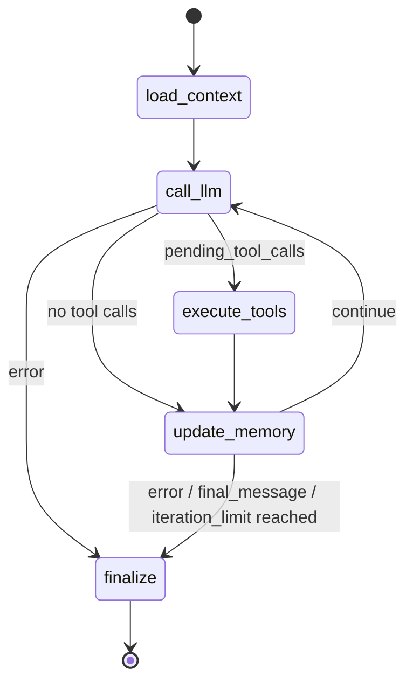

<!-- SUMMARY: N-Agent 的 DDD 业务架构速览，说明子域、核心流程、关键模型和外部边界 -->
# Agent 领域模型

N-Agent 是一款类似 Hermes 的 Agent Runtime。业务核心是接收对话请求，加载会话上下文，调用模型，按需执行工具，更新记忆，并返回同步或流式结果。

## 子域划分

```text
Agent Runtime
├── 核心子域
│   ├── Loop：运行状态推进、工具调用回环、结束判断
│   ├── AgentCore：模型调用、上下文组织、推理结果承接
│   ├── Memory：消息、会话、工具调用、任务状态、滚动摘要，以及外部记忆
│   ├── Action：把模型 tool_calls 转换为受控工具执行
│   └── Policy：工具权限、风险等级、执行约束和安全决策
├── 支撑子域
│   ├── Skill：本地SKILL.md包管理，通过skills_list/skill_view暴露给 LLM 自助使用
│   ├── Knowledge：KB的SPI定义、实例管理，通过search_knowledge检索知识
│   └── Platform/Gateway：CLI、飞书等交互的平台抽象、生命周期管理
└── 通用子域
    └── Environment：模型、存储、文件、网络等外部资源边界
```

## Loop FSM
```text
User Message
    ↓
AgentCore
    ↓
Tool Calls?
    ├─ Yes → Execute Tool → Observation → AgentCore
    └─ No  → Final Answer
```


库：LangGraph.Graph.StateGraph

## AgentCore
AgentCore: Single-Turn Inference Engine(单轮推理引擎)

```text
Input
├── Runtime State
│     ├── History
│     ├── Current Input
│     ├── Summary
│     ├── Memory
│     └── Optional Retrieved Context
├── Runtime Capabilities
│     └── Tool Registry
├── Runtime Constraints
│     └── Policies
└── Model Configuration

        ↓

AgentCore

        ↓

Output
├── Assistant Message
├── Tool Calls
├── Finish Reason
├── Usage
└── Reasoning Metadata
```

```text
AgentCore
│
├── Context Assembly: produces Message Context
│     ├── History
│     ├── Current Input
│     ├── Summary
│     ├── Memory
│     └── Optional Retrieved Context
│
├── Prompt Builder: produces System Context
│     ├── Identity
│     ├── Instruction
│     ├── Safety / Policy Guidance
│     ├── Platform Guidance
│     └── Prompt Composition
│
├── Tool Assembly: produces Tool Context
│     ├── Tool Selection
│     ├── Authorization
│     ├── Schema Normalization
│     └── Tool Choice
│
├── Request Normalization: produces Provider-Agnostic Inference Request
│     ├── System Context
│     ├── Message Context
│     ├── Tool Context
│     └── Generation Parameters
│
├── Provider Adapter
│     ├── adapts to Provider API Request
│     ├── invokes Provider
│     └── receives Raw Provider Response
│
├── Response Normalization: produces Normalized Inference Result
│     ├── Content
│     ├── Tool Calls
│     ├── Finish Reason
│     ├── Usage
│     ├── Reasoning Metadata
│     └── Raw Response
│
└── Inference Handoff: produces Agent Runtime Output
      ├── Assistant Message
      ├── Tool Calls
      ├── Finish Reason
      ├── Usage
      └── Reasoning Metadata
```

## Memory

### Memory Type
Memory 子域负责让 Agent 在单轮推理之外保留上下文，按生命周期分如下两类。

```text
Memory
├─ 会话记忆（SQLite持久化，session内有效）
│  ├─ 会话 ConversationSession
│  ├─ 消息 ConversationMessage
│  ├─ 工具调用 ToolCall
│  ├─ 任务状态 TaskState
│  └─ 滚动摘要 Summary
└─ 外部记忆（跨session持久，按载体分三类）
   ├─ 系统记忆（builtin）：根目录下的 {memory,user,observations}.md、memory.meta.json
   │    ├─ memory.md：稳定知识
   │    ├─ user.md：用户偏好
   │    ├─ observations.md：sync_turn 自动抽取的轮次关键词
   │    └─ memory.meta.json：memory.md 条目的信任度/时间衰减元数据
   ├─ 文件记忆（multi-project）：按项目目录拆分的多组 {memory,user}.md
   └─ 检索记忆（external-query）：通过query走向量/语义检索拿回相关片段，互斥、全局至多1个active provider
        ├─ mem0：服务端事实库（HTTP）
        ├─ holographic：本地 SQLite + MemoryRetriever（HRR 向量库）
        └─ honcho：用户建模 dialectic 库（HTTP）
```

### Context Frame（Memory In Context）

完整上下文可以理解为一次模型调用前组装出的 Context Frame，从稳定上下文、到本轮临时上下文逐层合成。Memory 不是单独追加的一段文本，而是根据特征进入稳定层、会话层、本轮层。最终发给模型的是 Provider Request(provider-agnostic request)，返回后再拆成 assistant message、tool calls、usage 和推理元数据。

```text
Context Frame（上下文来源分层）
├─ 1. Stable Context
│  ├─ System Context（静态常量，平台无关；多项拼为单条 system message）
│  │  ├─ identity: DEFAULT_AGENT_IDENTITY
│  │  ├─ instruction: REACT_GUIDANCE + KNOWLEDGE_GUIDANCE + MANAGED_TOOL_GUIDANCE
│  │  ├─ safety: SAFETY_GUIDANCE
│  │  └─ *外部记忆*静态快照：系统记忆（builtin）/文件记忆（multi-project）的 {memory,user}.md
│  └─ Capability Context
│     └─ tool definitions: name + description + parameters
│
├─ 2. Session Context（*会话记忆*）
│  ├─ 消息 ConversationMessage: 历史消息，包括 user / assistant / tool
│  ├─ 会话 ConversationSession: id + title + source + external_memory_enabled（持久化但不进入Provider Request）
│  ├─ 工具调用 ToolCall: 工具执行记录（持久化但不进入Provider Request，工具结果已包含在role=tool的消息中）
│  ├─ 任务状态 TaskState: 任务运行状态（持久化但不进入Provider Request）
│  └─ 滚动摘要 Summary（持久化但不进入Provider Request）
│
├─ 3. Turn Context
│  ├─ input: latest user messages
│  ├─ *外部记忆*动态检索（retrieved memory）: prefetch_all → <memory-context> 围栏，prepend 到 last user message content 副本
│  └─ run options: external_memory_enabled + tool_exposure_policy + tool_execution_context + execution_context_mode（控制信号，不进入Provider Request）
│
└─ 4. Execution Context（执行现场，不进入Provider Request）
   ├─ tool filtering: safe_only / default
   ├─ ToolExecutionContext: 工具授权 + execution_context_mode + enabled_override + trusted_metadata
   ├─ agent_context（trusted_metadata 内）: primary / subagent / cron / unattended（控制外部记忆写入权限）
   └─ 运行进度: AgentState.run_status / iteration_count / error（控制 finalize）

       │ 组装
       ▼

Provider Request
├─ messages  ← 1.System Context + 2.消息ConversationMessage + 3.input&retrieved memory
├─ tools     ← 1.Capability Context（经 4.tool filtering 过滤）
├─ tool choice: 默认
└─ generation params: temperature / top_p / top_k / max_tokens / stop_sequences / thinking / cache_control 等
```


用一轮真实对话，举例说明Context Frame，如下：

```text
## 对话
>> User：现在几点了？打印下UTC时间。
>> Tool：
{
  "tool_call_id": "call_u8usl364ddpffrw3q5758dk3",
  "name": "get_current_time",
  "status": "success",
  "content": {
    "now": "2026-06-27T15:52:06.344631+00:00"
  },
  "duration_ms": 0
}
>> Assistant：外部记忆1：当前的UTC时间是2026年06月27日 15:52:06.344631。


## Context Frame

会话事实：source=dashboard（primary），external_memory_enabled=["builtin","external_memory_1"]，
builtin/memory.md 为空，external_memory_1/memory.md = `所有的回复，必须以"外部记忆1："开头儿。`。
共 2 次 LLM 推理（iteration_count=2）：第 1 次产出 tool_calls，第 2 次产出 final。

=== 第 1 次推理 ===
1. Stable Context
   ├─ System Context
   │  ├─ identity / instruction / safety（静态常量）
   │  └─ *外部记忆*静态快照:
   │     ├─ builtin/memory.md → ""（空文件不产生 block，跳过）
   │     └─ external_memory_1/memory.md → "所有的回复，必须以"外部记忆1："开头儿。"
   └─ Capability Context: tool definitions（含 get_current_time）
2. Session Context（首轮 history 为空）
3. Turn Context
   ├─ input: "现在几点了？打印下UTC时间。"
   └─ *外部记忆*动态检索: ""（系统记忆/文件记忆 均用 MemoryRetriever 按 query 检索 memory.md entry；本例 query 与 external_memory_1 的 entry 无词重叠，返回空）
4. Execution Context: agent_context=primary，tool filtering=default
   │ 组装
   ▼
Provider Request #1
├─ messages: [system(含外部记忆静态快照), user("现在几点了？...")]
└─ tools: [get_current_time, ...]
→ LLM 返回: tool_calls=[get_current_time(id=call_u8us...)]

--- 中间落盘（execute_tools + update_memory #1）---
ToolCall 持久化: call_u8us..., get_current_time, success, result={now:2026-06-27T15:52:06.344631+00:00}
消息 ConversationMessage:
  ├─ append(role=assistant, content="", tool_calls=[...])
  └─ append(role=tool, tool_call_id=call_u8us..., content=result)  ← 工具结果经 role=tool 消息回流
TaskState: status=running, iteration_count=1
Summary: HeuristicSummarizer 覆盖（未达阈值，仍持久化；不进 Provider Request）
*外部记忆*自动更新: 本轮 LLM 未调用 external_memory 工具 → 文件未变

=== 第 2 次推理 ===
1. Stable Context（同 #1，外部记忆静态快照再次注入）
2. Session Context（首轮历史已落盘）
   ├─ 消息 ConversationMessage history:
   │  ├─ user("现在几点了？打印下UTC时间。")
   │  ├─ assistant(content="", tool_calls=[get_current_time])
   │  └─ tool(content={now:...})  ← 工具结果通过 role=tool 消息进入 history
   ├─ 工具调用 ToolCall: 已持久化（不进请求，结果已在 role=tool 消息中）
   ├─ 任务状态 TaskState: running（不进请求）
   └─ 滚动摘要 Summary: 已持久化（不进请求，仅作下次 summarize 入参）
3. Turn Context
   ├─ input: （无新 user 输入，本轮由 tool 结果驱动）
   └─ *外部记忆*动态检索: ""
4. Execution Context: iteration_count=1→2
   │ 组装
   ▼
Provider Request #2
├─ messages: [system(含外部记忆静态快照), user, assistant(tool_calls), tool(result)]
└─ tools: [get_current_time, ...]
→ LLM 返回: final="外部记忆1：当前的UTC时间是2026年06月27日 15:52:06.344631。"
   ↑ 前缀严格遵循 external_memory_1 静态快照指令 —— 证明外部记忆经 Stable Context 生效

--- finalize ---
消息 ConversationMessage: append(role=assistant, final)  ← scrub_memory_context 剥离 <memory-context>（本轮无此标签）
TaskState: status=completed, iteration_count=2
Summary: 覆盖为 "用户: 现在几点了？... | 助手: 外部记忆1：..."
*外部记忆*消息同步: sync_all(primary) → 系统记忆（builtin）.sync_turn 抽取关键词写入 observations.md；external_memory_1（文件记忆）.sync_turn 为 no-op

```


### 单轮写入时序

`ChatCompletionService.complete` → `AgentGraphRunner`（LangGraph）：

```text
complete
  ├─ 会话 ConversationSession: create_session (INSERT OR IGNORE)
  ├─ 会话 ConversationSession.external_memory_enabled: lock_session_external_memory（首写获胜）
  ├─ 消息 ConversationMessage: append_message(role=user) × N
  └─ 会话 ConversationSession.title: ensure_title（异步后台）
load_context（装配 working_messages：system + history + input）
  ├─ 消息 ConversationMessage: list_messages → 历史消息 history
  ├─ 滚动摘要 Summary: get_summary → state.summary（不进 messages，仅作下次 summarize 入参）
  └─ *外部记忆*静态快照: 随 system prompt 注入（Stable Context）
  ├─ *外部记忆*动态检索: prefetch_all → <memory-context> prepend 到 last user message 副本（不污染 state）
  ├─ llm.chat → Provider Request
  └─ scrub_memory_context(final_message.content)  # 立即剥离回声，防写回 消息 ConversationMessage
execute_tools
  ├─ 工具调用 ToolCall: save_tool_call 持久化工具执行事实
  └─ *外部记忆*自动更新: LLM 主动调用工具external_memory，更新外部记忆 Markdown 文件
update_memory（更新*会话记忆*）
  ├─ 消息 ConversationMessage: append_message(role=assistant, content 含 tool_calls)
  ├─ 消息 ConversationMessage: append_message(role=tool, tool_call_id, name)
  ├─ 任务状态 TaskState: save_task_state(status=running|failed)
  └─ 滚动摘要 Summary: summarize → save_summary（覆盖最新值）
       └─ *外部记忆*压缩前抢救: pre_compress_all → provider.on_pre_compress 返回要点，回填到 summary
finalize
  ├─ 消息 ConversationMessage: 错误兜底 append_message(role=assistant, 错误文案)
  ├─ *外部记忆*消息同步: sync_all，同步本轮对话内容、给外部记忆provider，系统记忆（builtin）写 observations.md，文件记忆（multi-project）/检索记忆（external-query）为 no-op
  └─ 任务状态 TaskState: save_task_state(status=run_status)
```

关键边界：会话记忆由 `MemoryStore` 屏蔽 SQLite；外部记忆由 `ExternalMemoryManager` 路由到 provider，写入路径有两条——LLM 主动调用 external_memory / multi_external_memory 工具（execute_tools 阶段），以及 finalize 阶段 sync_all 自动同步（系统记忆（builtin）写 observations.md，文件记忆（multi-project）/检索记忆（external-query）no-op。LLM 回声中的 `<memory-context>` 在 call_llm 内立即被 scrub_memory_context 剥离，避免把 Turn Context 的临时召回内容写回 消息 ConversationMessage。


---

## 分层边界

```text
Interfaces -> Application -> Domain
Infrastructure -> Domain
```

- Domain：定义 Agent、Session、Message、Tool、Policy、Provider、Memory、Platform/Gateway 等领域模型、值对象和端口协议。
- Application：编排 Agent Runtime、Prompt 构建、工具调度、会话流程和响应事件。
- Infrastructure：实现 OpenAI-compatible Provider、SQLite Memory、内置工具、Knowledge SQLite registry、Knowledge HTTP adapter 和配置加载。
- Interfaces：提供 FastAPI、OpenAI-compatible API、Dashboard、SSE 和协议转换。

Domain 不依赖 FastAPI、LangGraph、SQLite、OpenAI SDK 或具体工具实现。LangGraph 只是 Application 层的 Runtime Loop 实现细节。

## 核心业务流程
```text
客户端请求
  -> ChatCompletionService 创建/读取会话并写入用户消息
  -> AgentGraphRunner 加载历史消息和摘要
  -> LLMProvider 调用模型
  -> ToolService 校验 Policy 并执行模型请求的工具
  -> MemoryStore 写入助手消息、工具调用、任务状态和摘要
  -> 返回 ChatCompletion 或 SSE 事件
```

## 关键领域模型

| 类型 | 模型 | 说明 |
|------|------|------|
| 聚合根 | ConversationSession | 会话主实体，串联消息、工具调用、任务状态和摘要 |
| 运行状态 | AgentState | 单次 Agent 运行中的上下文、工具结果、状态和最终输出 |
| 实体 | ConversationMessage | 用户、助手、工具消息 |
| 实体 | ToolCall | 工具调用记录 |
| 实体 | TaskState | 当前任务运行状态 |
| 实体 | Summary | 会话摘要 |
| 实体 | ProviderConfig | Provider 注册表脱敏配置（id、name、provider_type、base_url、model、api_key_present、is_active、extra_headers、created_at、updated_at），不含 api_key 明文 |
| 值对象 | RiskLevel | 工具或动作的风险等级 |
| 值对象 | PermissionDecision | 工具或动作是否允许执行的判定结果 |
| 端口 | LLMProvider | 屏蔽具体模型服务 |
| 端口 | ProviderRegistry | Provider 配置注册表（CRUD + active 切换 + 明文 api_key 单独读取） |
| 端口 | MemoryStore | 屏蔽 SQLite 等存储实现 |
| 端口 | ToolExecutor | 屏蔽具体工具 handler |
| 端口 | Summarizer | 屏蔽摘要生成策略 |
| 端口 | TitleGenerator | 屏蔽会话标题生成策略，归属 Session 子域 |
| 实体 | Skill | 本地 SKILL.md 包：name、description、frontmatter、platforms、enabled、readiness、last_scan_status |
| 端口 | SkillRegistry | Skill 元数据持久化端口（list/get/upsert/set_enabled/delete），重扫保留 enabled 状态 |
| 实体 | KnowledgeBase | KB 后端实例脱敏配置：id、name、description、base_type、base_url、dataset_id、api_key_present、enabled、默认检索参数和 probe 状态 |
| 值对象 | KnowledgeBaseSecret | KB 明文密钥，只在 probe/search 时从 registry 单独读取 |
| 值对象 | KnowledgeSearchRequest | LLM 工具侧检索请求，kb_id 与 query 必填，不支持默认 KB |
| 值对象 | KnowledgeSnippet / KnowledgeSearchResult | 跨 N-KB/Ragflow 的标准检索结果 |
| 值对象 | Platform / PlatformKind / PlatformDescriptor | 交互平台枚举、平台类型和脱敏配置摘要 |
| 值对象 | GatewaySessionKey / GatewayConversation | 平台 conversation key 与 Dashboard 平台会话视图 |
| 端口 | PlatformRegistry / PlatformLifecycle | 平台 descriptor 与运行态查询端口 |
| 端口 | GatewaySessionRegistry | 平台 conversation 与内部 session 映射、事件幂等和平台统计查询端口 |
| 端口 | KnowledgeBaseRegistry | KB 配置注册表端口（CRUD + get_secret + probe 状态更新） |
| 端口 | KnowledgeRetriever / KnowledgeRetrieverFactory | KB 检索与探测 SPI，Infrastructure adapter 按 base_type 实现协议差异 |

Prompt 属于 Application Runtime 上下文，由 `build_system_prompt` 构造，不作为 Domain 模型，也不写入 Memory。

## Memory 业务关系

```text
ConversationSession
├── ConversationMessage  1:N
├── ToolCall             1:N
├── TaskState            1:0..1
└── Summary              1:0..1
```

SQLite Memory 默认使用 `sessions.db`。业务上以 session 为中心保存对话上下文；`AgentState` 只表示单次运行状态，不作为 SQLite 聚合根直接持久化。

Long-term Memory 当前由历史消息和 Summary 提供基础能力，后续可在 `MemoryStore` 端口下扩展。

## Action 业务关系

```text
LLM tool_calls
  -> ToolCallRequest
  -> Policy 判定
  -> ToolService
  -> ToolExecutor
  -> ToolResult
  -> ToolCall 持久化
```

当前工具能力包括：

- 内置工具：时间、计算、目录列表、文本读取。
- 知识库工具：`search_knowledge`，按必填 kb_id 检索已注册 KB 后端。

Knowledge 子域只表达 N-Agent 侧的检索 SPI 和 KB 后端实例配置。N-KB、Ragflow 是外部独立服务和协议类型，不属于 N-Agent 内部业务模型；N-Agent 通过 KnowledgeRetriever adapter 消费它们。

## Policy 业务关系

Policy 负责决定动作是否允许执行，避免把权限、安全和风险规则散落在 Tool handler 或 HTTP 接口里。

当前 Policy 主要覆盖：

- 工具是否启用。
- 工具风险等级：safe、confirm、dangerous。
- 工具执行权限判定：允许、拒绝、拒绝原因。
- 文件、网络等外部资源访问的安全约束。

当前以服务端 safe 工具为主；后续审批流、多 Agent、自动化任务和更完整的沙箱能力，都应优先扩展 Policy，而不是把规则写进具体工具实现。

## 外部边界

- Provider：只能通过 `LLMProvider` 端口访问，Runtime 不直接依赖具体 SDK。
- Storage：只能通过 `MemoryStore` 和 `Summarizer` 端口访问，SQLite 属于 Infrastructure。
- Tool：Application 层处理工具定义和执行编排，具体 handler 属于 Infrastructure。
- Policy：工具启用状态、风险等级、权限判定和资源访问约束属于业务规则，不下沉到具体 handler。
- Platform：平台描述、lifecycle 和 Gateway 会话统计通过 PlatformRegistry/GatewaySessionRegistry 端口进入 Application；飞书 SDK、长连接、HTTP 发送属于 Infrastructure/Interfaces 细节。
- FileSystem：文件工具必须围绕 workspace 根目录做路径安全约束。
- Network：主要用于模型调用、KB 后端检索、FastAPI HTTP/SSE 服务。

## 快速判断规则

- 业务模型和值对象放 Domain。
- 用例编排、Prompt、LangGraph Runtime 放 Application。
- FastAPI、Dashboard、OpenAI-compatible 协议适配放 Interfaces。
- SQLite、HTTP Client、具体工具 handler、Provider Adapter 放 Infrastructure。
- 权限、风险等级和执行约束优先归 Policy。
- 新增外部能力时先定义端口，再实现 Infrastructure Adapter。
