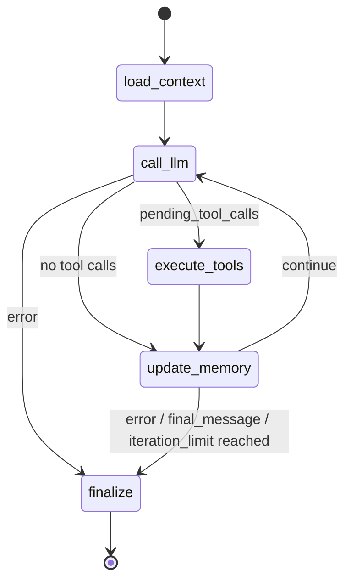

<!-- SUMMARY: N-Agent 的 DDD 业务架构速览，说明子域、核心流程、关键模型和外部边界 -->
# Agent 领域模型

N-Agent 是一款类似 Hermes 的 Agent Runtime。业务核心是接收对话请求，加载会话上下文，调用模型，按需执行工具，更新记忆，并返回同步或流式结果。

## 子域划分

```text
Agent Runtime
├── Loop：运行状态推进、工具调用回环、结束判断
├── AgentCore：模型调用、上下文组织、推理结果承接
├── Memory：消息、会话、工具调用记录、运行状态和摘要
├── Action：把模型 tool_calls 转换为受控工具执行
├── Policy：工具权限、风险等级、执行约束和安全决策
├── Skill：本地 SKILL.md 包扫描、元数据持久化、按需 view 渲染、宏预处理（${HERMES_SKILL_DIR}/${HERMES_SESSION_ID}）；通过 safe 工具 skills_list/skill_view 暴露给 LLM 自助使用
└── Environment：模型、存储、文件、网络等外部资源边界
```

## Loop FSM

库：LangGraph.Graph.StateGraph


---
---

## 分层边界

```text
Interfaces -> Application -> Domain
Infrastructure -> Domain
```

- Domain：定义 Agent、Session、Message、Tool、Policy、Provider、Memory 等领域模型、值对象和端口协议。
- Application：编排 Agent Runtime、Prompt 构建、工具调度、会话流程和响应事件。
- Infrastructure：实现 OpenAI-compatible Provider、SQLite Memory、内置工具、N-KB 检索工具和配置加载。
- Interfaces：提供 FastAPI、OpenAI-compatible API、Dashboard、SSE 和协议转换。

Domain 不依赖 FastAPI、LangGraph、SQLite、OpenAI SDK 或具体工具实现。LangGraph 只是 Application 层的 Runtime Loop 实现细节。

## 核心业务流程
```text
客户端请求
  -> ChatCompletionService 创建/读取会话并写入用户消息
  -> AgentGraphRunner 加载历史消息和摘要
  -> LLMProvider 调用模型
  -> ToolService 校验 Policy 并执行模型请求的工具
  -> MemoryStore 写入助手消息、工具调用、任务状态和摘要
  -> 返回 ChatCompletion 或 SSE 事件
```

## 关键领域模型

| 类型 | 模型 | 说明 |
|------|------|------|
| 聚合根 | ConversationSession | 会话主实体，串联消息、工具调用、任务状态和摘要 |
| 运行状态 | AgentState | 单次 Agent 运行中的上下文、工具结果、状态和最终输出 |
| 实体 | ConversationMessage | 用户、助手、工具消息 |
| 实体 | ToolCall | 工具调用记录 |
| 实体 | TaskState | 当前任务运行状态 |
| 实体 | Summary | 会话摘要 |
| 实体 | ProviderConfig | Provider 注册表脱敏配置（id、name、provider_type、base_url、model、api_key_present、is_active、extra_headers、created_at、updated_at），不含 api_key 明文 |
| 值对象 | RiskLevel | 工具或动作的风险等级 |
| 值对象 | PermissionDecision | 工具或动作是否允许执行的判定结果 |
| 端口 | LLMProvider | 屏蔽具体模型服务 |
| 端口 | ProviderRegistry | Provider 配置注册表（CRUD + active 切换 + 明文 api_key 单独读取） |
| 端口 | MemoryStore | 屏蔽 SQLite 等存储实现 |
| 端口 | ToolExecutor | 屏蔽具体工具 handler |
| 端口 | Summarizer | 屏蔽摘要生成策略 |
| 端口 | TitleGenerator | 屏蔽会话标题生成策略，归属 Session 子域 |
| 实体 | Skill | 本地 SKILL.md 包：name、description、frontmatter、platforms、enabled、readiness、last_scan_status |
| 端口 | SkillRegistry | Skill 元数据持久化端口（list/get/upsert/set_enabled/delete），重扫保留 enabled 状态 |

Prompt 属于 Application Runtime 上下文，由 `build_system_prompt` 构造，不作为 Domain 模型，也不写入 Memory。

## Memory 业务关系

```text
ConversationSession
├── ConversationMessage  1:N
├── ToolCall             1:N
├── TaskState            1:0..1
└── Summary              1:0..1
```

SQLite Memory 默认使用 `sessions.db`。业务上以 session 为中心保存对话上下文；`AgentState` 只表示单次运行状态，不作为 SQLite 聚合根直接持久化。

Long-term Memory 当前由历史消息和 Summary 提供基础能力，后续可在 `MemoryStore` 端口下扩展。

## Action 业务关系

```text
LLM tool_calls
  -> ToolCallRequest
  -> Policy 判定
  -> ToolService
  -> ToolExecutor
  -> ToolResult
  -> ToolCall 持久化
```

当前工具能力包括：

- 内置工具：时间、计算、目录列表、文本读取。
- 知识库工具：`search_knowledge`，通过 N-KB HTTP API 检索知识。

N-KB 是外部独立服务，不属于 N-Agent 领域模型。N-Agent 只通过工具端口消费它。

## Policy 业务关系

Policy 负责决定动作是否允许执行，避免把权限、安全和风险规则散落在 Tool handler 或 HTTP 接口里。

当前 Policy 主要覆盖：

- 工具是否启用。
- 工具风险等级：safe、confirm、dangerous。
- 工具执行权限判定：允许、拒绝、拒绝原因。
- 文件、网络等外部资源访问的安全约束。

当前以服务端 safe 工具为主；后续审批流、多 Agent、自动化任务和更完整的沙箱能力，都应优先扩展 Policy，而不是把规则写进具体工具实现。

## 外部边界

- Provider：只能通过 `LLMProvider` 端口访问，Runtime 不直接依赖具体 SDK。
- Storage：只能通过 `MemoryStore` 和 `Summarizer` 端口访问，SQLite 属于 Infrastructure。
- Tool：Application 层处理工具定义和执行编排，具体 handler 属于 Infrastructure。
- Policy：工具启用状态、风险等级、权限判定和资源访问约束属于业务规则，不下沉到具体 handler。
- FileSystem：文件工具必须围绕 workspace 根目录做路径安全约束。
- Network：主要用于模型调用、N-KB 检索、FastAPI HTTP/SSE 服务。

## 快速判断规则

- 业务模型和值对象放 Domain。
- 用例编排、Prompt、LangGraph Runtime 放 Application。
- FastAPI、Dashboard、OpenAI-compatible 协议适配放 Interfaces。
- SQLite、HTTP Client、具体工具 handler、Provider Adapter 放 Infrastructure。
- 权限、风险等级和执行约束优先归 Policy。
- 新增外部能力时先定义端口，再实现 Infrastructure Adapter。
